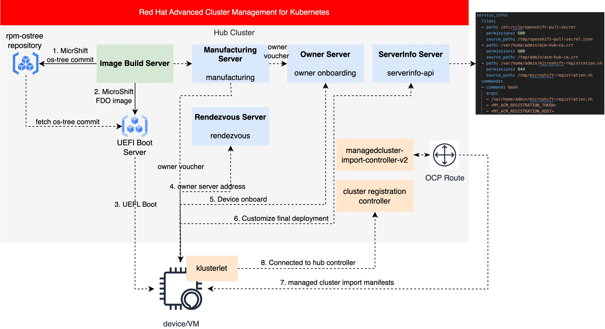

# MicroShift Registration to ACM using FDO

This document illustrates the deployment process for a RHEL for Edge system embedding MicroShift registered in [Red Hat Advanced Cluster Management for Kubernetes (RHACM)](https://www.redhat.com/en/technologies/management/advanced-cluster-management) using [FIDO Device Onboard](https://fidoalliance.org/intro-to-fido-device-onboard/).

> NOTE: This document is validated for compatibility with RHEL 9.2 and MicroShift versions 4.12 to 4.14.

## Overview



## Prerequisites

1. You have a bare metal machine at least 32GB of RAM and 16 vCPUs.
2. You have installed RHEL and you have subscribed to RHSM or Red Hat Satellite.
3. You have enabled the BaseOS and AppStream repositories.
4. Download the OpenShift [pull secret](https://console.redhat.com/openshift/downloads#tool-pull-secret) and store
it in the `~/.pull-secret.json` file.

## Deploy RHACM

1. Install [Red Hat Advanced Cluster Management for Kubernetes (RHACM)](https://www.redhat.com/en/technologies/management/advanced-cluster-management) with a version >= 2.9.0.

> Note: Make sure the bare metal machine can access the RHACM hub cluster.

2. Log into the RHACM from your bare metal machine and enable auto approval for registration controller:

```bash
cat << EOF > /tmp/clustermanager_patch.yaml
apiVersion: operator.open-cluster-management.io/v1
kind: ClusterManager
metadata:
  name: cluster-manager
spec:
  registrationConfiguration:
    featureGates:
      - feature: ManagedClusterAutoApproval
        mode: Enable
    autoApproveUsers:
      - system:serviceaccount:multicluster-engine:agent-registration-bootstrap
EOF

kubectl patch clustermanager cluster-manager --type=merge --patch-file "/tmp/clustermanager_patch.yaml"
```

3. Create a serviceaccount token for registration controller and bind it to the regitration client clusterrole:

```bash
cat << EOF | kubectl apply -f -
apiVersion: v1
kind: ServiceAccount
metadata:
  name: managed-cluster-import-agent-registration-sa
  namespace: multicluster-engine
---
apiVersion: v1
kind: Secret
type: kubernetes.io/service-account-token
metadata:
  name: managed-cluster-import-agent-registration-sa-token
  namespace: multicluster-engine
  annotations:
    kubernetes.io/service-account.name: "managed-cluster-import-agent-registration-sa"
---
kind: ClusterRoleBinding
apiVersion: rbac.authorization.k8s.io/v1
metadata:
  name: managed-cluster-import-agent-registration
roleRef:
  apiGroup: rbac.authorization.k8s.io
  kind: ClusterRole
  name: managedcluster-import-controller-agent-regitration-client
subjects:
  - kind: ServiceAccount
    name: managed-cluster-import-agent-registration-sa
    namespace: multicluster-engine
EOF
```

4. Extra the ACM hub CA, registration token and registration host:

```bash
kubectl get configmap -n kube-system kube-root-ca.crt -o=jsonpath="{.data['ca\.crt']}" > acm-hub-ca.crt
export ACM_REGISTRATION_TOKEN=$(kubectl get secret -n multicluster-engine managed-cluster-import-agent-registration-sa-token -o=jsonpath='{.data.token}' | base64 -d)
export ACM_REGISTRATION_HOST=$(kubectl get route -n multicluster-engine agent-registration -o=jsonpath="{.spec.host}")
```

## Deploy FDO Services

1. Install [fdo-operator](https://github.com/fdo-rs/fdo-operator) in the RHACM hub cluster:

```bash
cat << EOF | oc apply -f -
apiVersion: operators.coreos.com/v1alpha1
kind: CatalogSource
metadata:
  name: fdo-operator-registry
  namespace: openshift-marketplace
spec:
  displayName: FIDO Device Onboarding (FDO) Operator Catalog
  image: ghcr.io/empovit/fdo-operator-catalog:v99.0.0
  publisher: Red Hat
  sourceType: grpc
  updateStrategy:
    registryPoll:
      interval: 10m
---
apiVersion: operators.coreos.com/v1alpha1
kind: Subscription
metadata:
  name: fdo-operator
  namespace: openshift-operators
spec:
  channel: alpha
  installPlanApproval: Automatic
  name: fdo-operator
  source: fdo-operator-registry
  sourceNamespace: openshift-marketplace
  startingCSV: fdo-operator.v99.0.0
---
EOF
```

2. Generate the certificate pairs for the FDO services:

```bash
git clone git@github.com:fdo-rs/fdo-operator.git && cd fdo-operator
oc project fdo
export FDO_CERT_ORG=redhat.com
make keys-gen && make keys-push
```

3. Deploy the FDO services:

```bash
cat << EOF | oc apply -f -
---
apiVersion: v1
kind: Namespace
metadata:
  name: fdo
---
kind: PersistentVolumeClaim
apiVersion: v1
metadata:
  name: fdo-ownership-vouchers-pvc
  namespace: fdo
spec:
  accessModes:
    - ReadWriteOnce
  resources:
    requests:
      storage: 10Mi
---
apiVersion: fdo.redhat.com/v1alpha1
kind: FDOManufacturingServer
metadata:
  name: manufacturing-server
  namespace: fdo
spec:
  logLevel: TRACE
  protocols:
    plainDI: false
    diun:
      allowedKeyStorageTypes:
        - FileSystem
        - Tpm
      keyType: SECP256R1
  rendezvousServers:
    - dns: rendezvous-server-fdo.$(oc get ingresscontroller -n openshift-ingress-operator default -o jsonpath={.status.domain})
      devicePort: 80
      ownerPort: 80
      protocol: http
---
apiVersion: fdo.redhat.com/v1alpha1
kind: FDORendezvousServer
metadata:
  name: rendezvous-server
  namespace: fdo
spec: {}
---
apiVersion: fdo.redhat.com/v1alpha1
kind: FDOOnboardingServer
metadata:
  name: onboarding-server
  namespace: fdo
spec:
  serviceInfo:
    commands:
      - command: /root/registration-to-acm.sh
        args: []
        mayFail: false
        returnStdOut: true
        returnStdErr: true
---
EOF
```

4. Add RHACM registration configuration files to the FDO service-info server:

```bash
cat << EOF | oc apply -f -
apiVersion: v1
binaryData:
  registration-to-acm.sh: $(cat ./scripts/registration-to-acm.sh | base64 -w0)
immutable: false
kind: ConfigMap
metadata:
  annotations:
    fdo.serviceinfo.file/name: registration-to-acm.sh
    fdo.serviceinfo.file/path: /root/registration-to-acm.sh
    fdo.serviceinfo.file/permissions: "755"
  labels:
   fdo.serviceinfo.file/owner: onboarding-server
  name: fdo-registration-to-acm
  namespace: fdo
---
apiVersion: v1
binaryData:
  microshift-pull-secret.json: $(cat ~/.pull-secret.json | base64 -w0)
immutable: false
kind: ConfigMap
metadata:
  annotations:
    fdo.serviceinfo.file/name: microshift-pull-secret.json
    fdo.serviceinfo.file/path: /root/microshift-pull-secret.json
    fdo.serviceinfo.file/permissions: "600"
  labels:
   fdo.serviceinfo.file/owner: onboarding-server
  name: fdo-microshift-pull-secret
  namespace: fdo
---
apiVersion: v1
binaryData:
  acm-hub-ca.crt: $(cat acm-hub-ca.crt | base64 -w0)
immutable: false
kind: ConfigMap
metadata:
  annotations:
    fdo.serviceinfo.file/name: acm-hub-ca.crt
    fdo.serviceinfo.file/path: /root/acm-hub-ca.crt
    fdo.serviceinfo.file/permissions: "600"
  labels:
   fdo.serviceinfo.file/owner: onboarding-server
  name: fdo-acm-hub-ca
  namespace: fdo
---
apiVersion: v1
binaryData:
  acm-registration-host: $(echo $ACM_REGISTRATION_HOST | base64 -w0)
immutable: false
kind: ConfigMap
metadata:
  annotations:
    fdo.serviceinfo.file/name: acm-registration-host
    fdo.serviceinfo.file/path: /root/acm-registration-host
    fdo.serviceinfo.file/permissions: "600"
  labels:
   fdo.serviceinfo.file/owner: onboarding-server
  name: fdo-acm-registration-host
  namespace: fdo
---
apiVersion: v1
binaryData:
  acm-registration-token: $(echo $ACM_REGISTRATION_TOKEN | base64 -w0)
immutable: false
kind: ConfigMap
metadata:
  annotations:
    fdo.serviceinfo.file/name: acm-registration-token
    fdo.serviceinfo.file/path: /root/acm-registration-token
    fdo.serviceinfo.file/permissions: "600"
  labels:
   fdo.serviceinfo.file/owner: onboarding-server
  name: fdo-acm-registration-token
  namespace: fdo
---
EOF
```

## Build and Publish OSTree Image

1. Install image builder tools:

```bash
./scripts/0-pre-requisites-osbuild.sh
```

2. Prepare the blueprint using the `blueprint-microshift.toml.example` as reference including the ssh key and user information.

Make a copy of the blueprint example file (ie, `cp blueprint-microshift.toml.example blueprint-microshift.toml`) and include the SSH key and the password hash.

2. Build the edge ostree image that contains the MicroShift package:

```bash
./scripts/1-create-image.sh -b blueprint-microshift.toml
```

3. Publish the ostree commit and then build the simplified installer image:

```bash
./scripts/2-publish-image.sh -i <image-id-from-last-step> -f <fdo-manufacturing-server-address> -x 8091
```

> Note: the `<fdo-manufacturing-server-address>` can be retrieved by running `oc get route manufacturing-server -o jsonpath="{.status.ingress[0].host}"`.

## Launch VM, Run MicroShift and Register to ACM.

In this section, we will emulates the actual boot process of an edge device by initiating a virtual machine (VM) from an HTTP boot server using the libvirt virtualization platform. In the last section, the established HTTP boot server hosts an OS image integrating MicroShift and FDO client services. Upon boot, the FDO client initiates communication with FDO services to obtain the ownership voucher to onboard the device. Subsequently, it connects to the RHACM hub cluster to register the MicroShift cluster.

1. Install the libvirt tools:

```bash
dnf install -y libvirt virt-manager virt-install virt-viewer libvirt-client qemu-kvm qemu-img cockpit-machines
systemctl enable libvirtd.service --now
```

2. Configure the libvirt network to include the HTTP boot server as a DHCP option:

```bash
virsh net-list
virsh net-edit default # see the following example network for reference
virsh net-destroy default
mkdir -p /var/lib/tftpboot
virsh net-start default
```

An example of the libvirt network setup:

```xml
<network xmlns:dnsmasq="http://libvirt.org/schemas/network/dnsmasq/1.0">
  <name>default</name>
  <uuid>3a4b328c-f199-476b-bfc6-d79043f07019</uuid>
  <forward mode='nat'>
    <nat>
      <port start='1024' end='65535'/>
    </nat>
  </forward>
  <bridge name='virbr0' stp='on' delay='0'/>
  <mac address='52:54:00:be:34:21'/>
  <ip address='192.168.122.1' netmask='255.255.255.0'>
    <tftp root="/var/lib/tftpboot"/>
    <dhcp>
      <range start='192.168.122.2' end='192.168.122.254'/>
      <bootp file="pxelinux.0"/>
    </dhcp>
  </ip>
  <dnsmasq:options>
    <dnsmasq:option value="dhcp-vendorclass=set:efi-http,HTTPClient:Arch:00016"/>
    <dnsmasq:option value="dhcp-option-force=tag:efi-http,60,HTTPClient"/>
    <dnsmasq:option value="dhcp-boot=tag:efi-http,&quot;http://192.168.122.1:8091/EFI/BOOT/BOOTX64.EFI&quot;"/>
    <dnsmasq:option value='log-queries'/>
    <dnsmasq:option value='log-dhcp'/>
    <dnsmasq:option value='log-debug'/>
  </dnsmasq:options>
</network>
```

3. Initiate the deployment of the edge server by initiating a UEFI boot, with the NIC designated as the initial boot device. Please be patient during the boot process, as there may be a brief delay while the system attempts PXE boot before transitioning to UEFI HTTP boot and initiating the installation.

```bash
virt-install \
    --name=edge-microshift-fdo \
    --disk path=/tmp/edge-microshift-fdo.qcow2,size=20 \
    --ram=2048 \
    --vcpus=2 \
    --os-type=linux \
    --os-variant=rhel9.2 \
    --network=network=default,model=virtio \
    --boot uefi
```

> Note: The Edge server must have at least 2GB of RAM in order to download the ISO to memory during the installation process.

4. Log into the VM after the VM reboot with configured username and password.

```bash
virsh domifaddr edge-microshift-fdo
$ssh admin@${VM_IP} #admin/admin
```

> Note: After the deployment it could take some time until the fdo-client runs and configures everything. You can double check if that happened taking a look at the Journal (`journalctl | grep "Performing TO2 protocol"`) or forcing it with `systemctl restart fdo-client-linuxapp.service`.

## Verify Device Onboarding

1. Log into the device and check FDO device credential in VM:

```shell
$ fdo-owner-tool dump-device-credential /boot/device-credentials
Active: true
Protocol Version: 101
Device Info:
Device GUID: 343a5e10-9476-7758-b503-ae5fa8ec8290
Rendezvous Info:
	- [(DevicePort, [25, 31, 146]), (IPAddress, [68, 10, 73, 130, 147]), (OwnerPort, [25, 31, 146]), (Protocol, [1])]
Public key hash: e1c3a8005c66ac1c50d39b3843852c9bf76c3466dc1811670ac7defbf11a64c90adca6307c079aa39cc646114423efb3 (Sha384)
HMAC and signing key:
	HMAC key: <secret>
	Signing key: <secret>
```

2. Check the device credential on FDO server:

```shell
$ oc exec deploy/manufacturing-server -- ls /etc/fdo/ownership_vouchers
343a5e10-9476-7758-b503-ae5fa8ec8290
```

3. Check the klusterlet pod is up and running in VM:

```shell
# oc get pod -n open-cluster-management-agent
NAME                                               READY   STATUS    RESTARTS        AGE
klusterlet-74c99cfbd-2xkvs                         1/1     Running   0               8m25s
klusterlet-registration-agent-7f56696bb-b4qxw      1/1     Running   0               117s
klusterlet-work-agent-59d5f86964-47227             1/1     Running   0               
```
